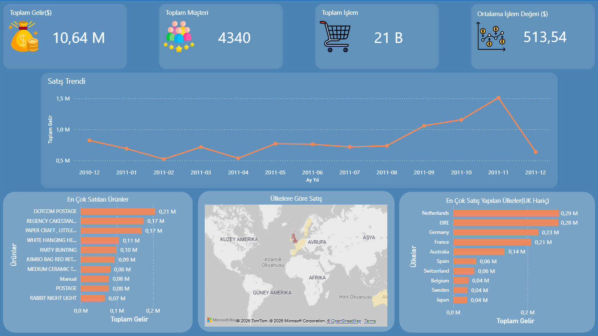
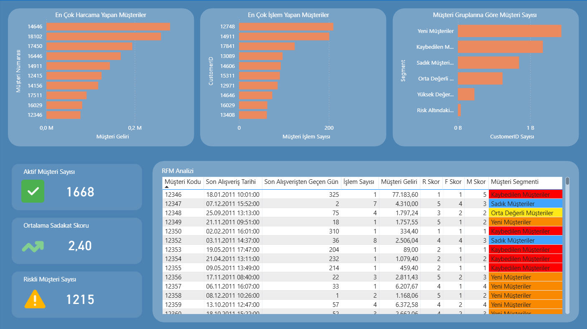

# 📊 Customer Analytics Dashboard (RFM Analysis)

This project focuses on customer behavior analysis using Power BI and RFM segmentation.

---

## 🚀 Project Overview

The goal of this project is to analyze customer purchasing behavior and segment customers based on their value using RFM (Recency, Frequency, Monetary) analysis.

The dashboard provides actionable insights for business decision-making, customer retention strategies, and revenue optimization.

---

## 📊 Dashboard Preview

### 🔹 General Overview

### 🔹 Customer Analysis

---

## 📌 Key Features

- Customer segmentation (RFM)
- Sales trend analysis
- Top customers by revenue
- Top customers by transaction frequency
- Country-based sales analysis
- Risky and lost customer identification

---

## 🧠 RFM Metrics

- **Recency**: Days since last purchase
- **Frequency**: Number of transactions
- **Monetary**: Total spending

---

## 🎯 Customer Segments

- High Value Customers
- Loyal Customers
- New Customers
- At Risk Customers
- Lost Customers
- Mid Value Customers

---

## 🛠 Tools Used

- Power BI
- DAX
- Power Query

---

## 📂 Dataset

Online Retail Dataset (public dataset)

---

## 📁 Project Structure

- report/ → Power BI report (.pbix)
- images/ → Dashboard screenshots
- data/ → Dataset (optional)

---

## 📌 Insights

- High value customers generate significant revenue but may require retention strategies
- A large portion of customers fall into low engagement segments
- Customer segmentation enables targeted marketing strategies

---

👤 Developed by **Kenan Avşar**
